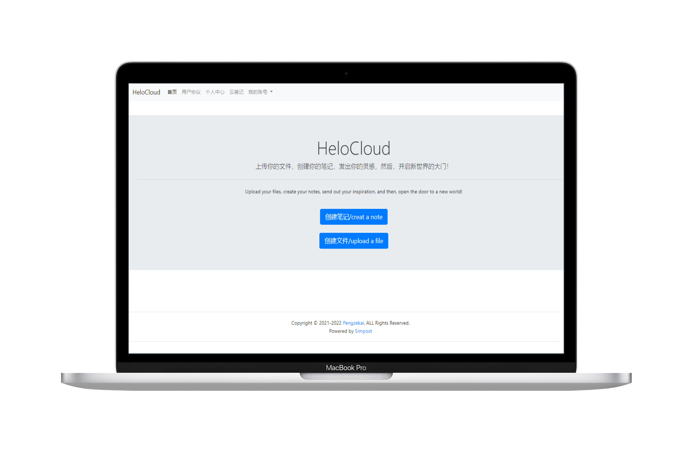

# HeloCloud

#### 介绍
HeloCloud 是一个简单的php开发的网盘，提供给用户直接链接服务，1.0版本使用zui作为前端框架搭建，其后的版本使用bootstrap作为前端框架，后端基于simpost框架进行深度优化制作，感谢大家使用，其1.0版本使用开源协议为木兰2.0协议和cc4.0协议，但其2.0版本为木兰2.0和Hele open source license V3.1[HSL 3.1]进行发布

 **下载使用** `git clone https://gitee.com/penkai/helo-cloud.git`

- HSL 3.1 ：[https://pzks.github.io/2021/04/30/Hele-open-source-license/](https://pzks.github.io/2021/04/30/Hele-open-source-license/)

- 适用HSL 3.1 的文件有upload文件夹里的代码文件以及index.php，footer.php，safety.php，reg.php

- 适用CC-BY-ND-SA的文件有xieyi.php，config/license.txt

- 其余文件适用于木兰2.0协议

#### 版本发展
| 版本   | 日期        | 修改内容           |
|------|-----------|----------------|
| v1.0 | 2022.2.12 | 第一个版本，bug版本    |
| v2.0 | 2022.2.17 | 第二个版本，修复了n个bug，添加新功能 |

1. 2.0添加的新功能：重置UI优化前端（换框架）,实现安全登录（密码cookie比较）不会像1.0那样改cookie就可以登录,实现登录注册验证码（防止恶意注册）,更改注册登录机制,添加文件删除功能，新增读取文件大小和创建日期，新增非法登录检查，新增404.php页面等
2. 2.0修复的问题：xss注册漏洞，修复空文件漏洞，修复上传漏洞等

#### 使用到的项目

1. sweetalert弹窗：https://sweetalert.bootcss.com/
2. Strapdown.js解释器：https://github.com/arturadib/strapdown/
3. jquery前端：https://jquery.com/
4. openzui前端：http://www.openzui.com/
5. bootstrap前端：https://getbootstrap.com/

#### 致谢
感谢bilibili的广大网友提出的bug建议，感谢那些找bug的人，感谢那些提供建议的人